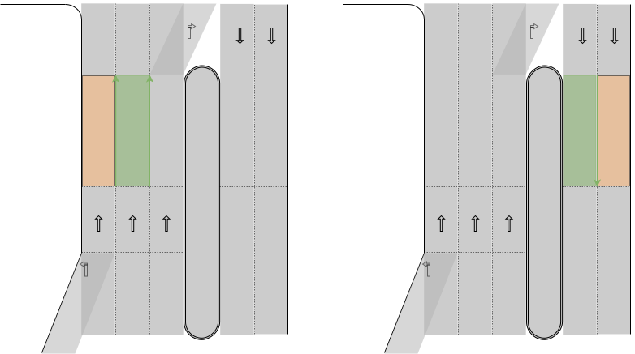
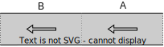

# autoware_lanelet2_utility

## Nomenclature

This package aims to strictly define the meaning of several words To disambiguate the documentation and API's scope. In the table below, `codespace` words are given specific meanings when used in API and API description. _italic_ words are emphasized to indicate that it refers to social common sense which often comes with ambiguity. To help clarify the meaning, illustration is provided. "Lanelet" refers to the entity of a`lanelet::Lanelet` object in order to distinguish with the word "lane" used in social customs. `A` and `B` stands for Lanelets objects.

| Word                              | Meaning                                                                                                                             | Illustration                                                                                                                                                                                                                                                    |
| --------------------------------- | ----------------------------------------------------------------------------------------------------------------------------------- | --------------------------------------------------------------------------------------------------------------------------------------------------------------------------------------------------------------------------------------------------------------- |
| `driving`                         | The vehicle position belongs to the designated Lanelet.                                                                             | In each map, green Lanelet are the `driving` lanes of the vehicle. <br>                                                                                                                                      |
| `boundary`,<br>`entry`,<br>`exit` | The `boundary` of a Lanelet refers to the left or right Linestring.                                                                 |                                                                                                                                                                                      |
| `adjacent`                        | If A is `adjacent` to B, A and B share a common `boundary` with same direction either on the left or right side.                    | In each map, orange Lanelet is `adjacent` to green Lanelet. <br>                                                                                                                                           |
| `same_direction`                  | Lanelet A and Lanelet B are `same_direction` if A and B are directly or indirectly `adjacent` to each other.                        | In each map, orange Lanelets are `same_dirction` as green Lanelet. <br>                                                                                                                        |
| `bundle`                          | A `bundle` refers to a transitive closure set of Lanelets which are `same_direction` to each other.                                 | The enclosed sets of Lanelets are `bundle`s. <br>                                                                                                                                                              |
| `opposite`                        | If A is `opposite` to B, A and B share a common `boundary` with opposite direction.                                                 | In the first map, green Lanelet and orange Lanelet are `opposite` to each other. <br> In the second map, two red Lanelets are not `opposite` relation because they do not share a common LineString. <br>  |
| `opposite_direction`              | If A and B are `opposite_direction`, the bundle of A and B are directly `opposite` to each other.                                   | In the each map, green Lanelet and orange Lanelet are `opposite_direction` becauase their `bundle`s(enclosed in dotted line) are `opposite` relation. <br>                             |
| `connected`                       | A is `connected` to(from) B if and only if the `exit`(`entry`) of A is identical to the `entry`(`exit`) of B.                       | A is connected to B, and B is connected from A. <br>                                                                                                                                                     |
| `following`                       | The `following` Lanelets of A is the list of Lanelets to which A is `connected`.                                                    | In each map, orange Lanelets are the `following` of green Lanelet. <br>                                                                                                                                  |
| `previous`                        | The `previous` Lanelets of A is the list of Lanelets from which A is `connected`.                                                   | In each map, orange Lanelets are the `previous` of green Lanelet. <br>                                                                                                                                     |
| `conflicting`                     | A is `conflicting` with B if A and B are geometrically intersecting.                                                                |                                                                                                                                                                                                                                                                 |
| `merging`                         | A is said to be `merging` Lanelet of B if and only if A is `conflicting` with B and both A and B are connected to a common Lanelet. | In each map, one of the orange Lanelet is a `mergin` Lanelet of the other orange Lanelet. <br>                                                                                                               |
| `sibling`                         | The designated Lanelets are refered to as `sibling` if all of them are `connected` from a common Lanelet.                           | In each map, orange Lanelets are `sibling`s. <br>                                                                                                                                                            |
| `oncoming`                        | TBD                                                                                                                                 | TBD                                                                                                                                                                                                                                                             |
| `upcoming`                        | TBD                                                                                                                                 | TBD                                                                                                                                                                                                                                                             |
| `sequence`                        | `sequence` is a list of Lanelets whose each element is `connected from` or `adjacent to` the previous element.                      |                                                                                                                                                                                                            |

## API description

## How to craft test map

On the VMB, create the map in local projector(or convert it to local projector from MGRS projector) and save the file as `<input_map.osm>`. Next, select the point to use as (0.0, 0.0) and pass its `<ID>` and run

```bash
ros2 run autoware_lanelet2_utility lanelet_anonymization_local.py <inpput_map.osm> <output_map.osm> <ID>
```

Then the coordinate of the specified point is (0, 0) on the loaded map
